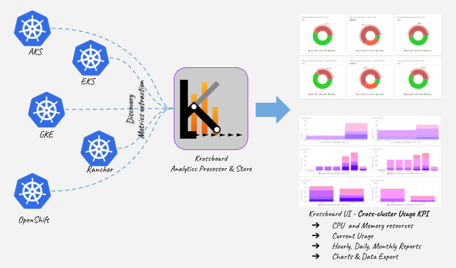

- [Overview](#overview)
- [Getting Started](#getting-started)
- [Open to Contributions](#open-to-contributions)

--- 
 
# Overview
Krossboard provides an advanced & centralized resource usage analytic and accounting for multiple Kubernetes. The Kubernetes clusters can be on premises and/or in the cloud, self-deployed or managed.

Key features:

* **Cross-Cloud & Cross-Kubernetes distributions**: By design, Krossboard enables to tackle usage analytics & accounting for multiple Kubernetes clusters, regardless of the distribution. It's actively tested against Amazon EKS, Microsoft AKS, Google GKE, Red Hat OpenShift and vanilla Kubernetes.
* **Visualization at a central place**: An instance of Krossboard provides an *comprehensive and consistent usage analytics and accounting* framework over the different Kubernetes clusters it handles. This unique feature helps financial and engineering teams to finely understand their Kubernetes spendings, so to be able to take appropriate cost optimization decisions.
* **Deploy in minutes, for multiple clusters**: Krossboard is an integrated and easy-to-deploy tool. It can be installed in a couple of minutes thanks to its ready-to-install artifacts: virtual machine appliances, cloud images, or binary packages.
* **Consistent Accounting for Cost allocation and Capacity planning**: Krossboard regularly collects instantaneous usage metrics, then aggregate and consolidate over time to produce short-term (hourly), mid-term (daily) and long-term (monthly) usage accounting covering up to a year. At any point or period of time, your organization can get relevant accounting insights for cost allocation and capacity planning.
* **Discovery of Managed Kubernetes clusters**:  When deployed on a supported cloud environment, Krossboard can be configured to automatically discover and track the usage of your managed Kubernetes on Amazon EKS, Google GKE and Microsoft AKS.
* **Extensible analytics/reports**: Krossboard enables REST API to expose the analytics data it generates to third-parties analytics systems. Data can be exposed in JSON or CSV format.

# Getting Started
* [Setup Krossboard for Multi-Cloud or Cross-Kubernetes Distributions](https://krossboard.app/docs/60_deploy-for-cross-cloud-and-on-premises-kubernetes/)
* [Setup Krossboard for Amazon EKS](https://krossboard.app/docs/50_deploy-for-amazon-eks/)
* [Setup Krossboard for Azure AKS](https://krossboard.app/docs/30_deploy-for-azure-aks/)
* [Setup Krossboard for Google GKE](https://krossboard.app/docs/20_deploy-for-google-gke/)

# Open to Contributions
This repository provides release packages, [scripts and built-in configuration files](tooling/setup) used to set up Krossboard.

We encourage feedback and always make our best to handle any issues as fast as possible. Don't hesitate to submit issues or feature requests.

.

