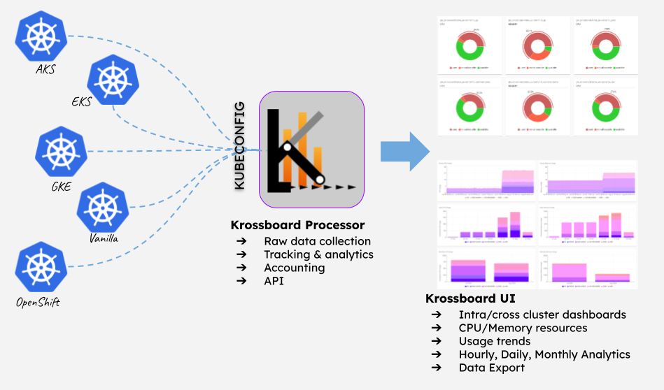

---

<!-- vscode-markdown-toc -->
- [Krossboard Kubernetes Operator](#krossboard-kubernetes-operator)
- [Deploy Krossboard Kubernetes Operator](#deploy-krossboard-kubernetes-operator)
- [Deploy a Krossboard Instance](#deploy-a-krossboard-instance)
  - [Create a Krossboard CRD](#create-a-krossboard-crd)
  - [Create a KUBECONFIG secret for target Kubernetes](#create-a-kubeconfig-secret-for-target-kubernetes)
  - [Start the Krossboard Instance](#start-the-krossboard-instance)
- [Day2 Operations](#day2-operations)

<!-- vscode-markdown-toc-config
	numbering=false
	autoSave=true
	/vscode-markdown-toc-config -->
<!-- /vscode-markdown-toc -->

# Krossboard Kubernetes Operator

[Krossboard](https://www.krossboard.app/) is a multi-cluster and cross-distribution Kubernetes usage accounting and analytics software. 

> Learn about [Krossboard Features](./docs/what-is-krossboard.md).

Krossboard Operator provides custom resource definitions (CRD) along with an operator to deploy and manage instances of Krossboard as Kubernetes pods.




The [Krossboard CRD](https://raw.githubusercontent.com/2-alchemists/krossboard-kubernetes-operator/main/config/releases/latest/krossboard/krossboard-kubernetes-operator.yaml) defines a Krossboard instance as a Kind, as well as parameters to bootstrap that instance: krossboard-api, krossboard-ui, krossboard-consolidator, krossboard-kubeconfig-handler, kube-opex-analytics instances.

Each instance of Krossboard enables to track the usage of a set of Kubernetes clusters listed in a KUBECONFIG secret:

* Secret Name: `krossboard-secrets`
* Secret Key: `kubeconfig`.

The next steps describe how to deploy the operator and a Krossboard instance.

# <a name='DeployKrossboardOperator'></a>Deploy Krossboard Kubernetes Operator
The following command deploy the latest version of Krossboard Operator.

```bash
kubectl apply -f https://raw.githubusercontent.com/2-alchemists/krossboard-kubernetes-operator/main/config/releases/latest/krossboard/krossboard-kubernetes-operator.yaml
```

The installation is achieved in a namespace named `krossboard`.


# <a name='DeployaKrossboardInstance'></a>Deploy a Krossboard Instance

## <a name='CreateaKrossboardCRD'></a>Create a Krossboard CRD

Once the operator deployed, a custom resource named `Krossboard` is created. This CRD is used to define each instance of Krossboard.

See [krossboard.yaml](https://github.com/2-alchemists/krossboard-kubernetes-operator/blob/main/config/releases/latest/krossboard/krossboard.yaml) for an example of Krossboard instance definition.

Each instance of Krossboard allows to track the usage of a set of Kubernetes clusters listed in a KUBECONFIG secret (Secret Name: `krossboard-secrets`, Secret Key: `kubeconfig`). 

> A different secret can be used (instead of `krossboard-secrets`). In this case, you must set the parameter `krossboardSecretName` of the Krossboard CRD with the name of the target secret.


## <a name='CreateaKUBECONFIGsecretfortargetKubernetes'></a>Create a KUBECONFIG secret for target Kubernetes
Given a KUBECONFIG resource (`/path/to/kubeconfig` in the below command), you can create a secret for Krossboard Operator as follows. 

```bash
kubectl -n krossboard \
    create secret --type=Opaque generic krossboard-secrets \
    --from-file=kubeconfig=/path/to/kubeconfig
```

> * Learn how to [Create a KUBECONFIG resource with minimal permissions for Krossboard](./docs/create-kubeconfig-with-minimal-permissions.md).
> * Learn how to [Create a secret from several KUBECONFIG resources](./docs/create-kubeconfig-secret.md)


## <a name='StarttheKrossboardInstance'></a>Start the Krossboard Instance
The below command deploys an instance of Krossboard based on the latest version.

```bash
kubectl -n krossboard apply -f https://raw.githubusercontent.com/2-alchemists/krossboard-kubernetes-operator/main/config/releases/latest/krossboard/krossboard-deployment.yaml
```

# Day2 Operations

* https://krossboard.app/
* [Krossboard Enterprise Support](https://krossboard.app/#pricing) 
